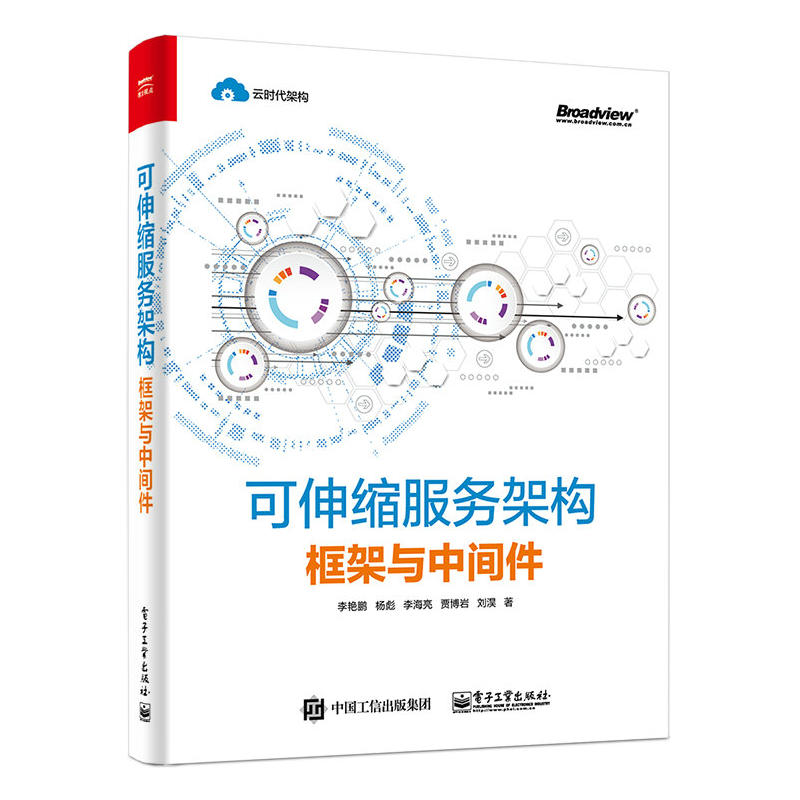

<!-- toc -->

## 第1章 如何设计一款用不重复的高性能分布式发号器

### 1.1 可选方案及技术选型

#### 1.1.1 为什么不用 UUID

#### 1.1.2 基于数据库的实现方案

#### 1.1.3 Snowflake 开源项目

### 1.2 分布式系统对发号器的基本要求

- 全局唯一
- 粗略有序
- 可反解
- 可制作
- 高性能
- 高可用
- 可伸缩

### 1.3 架构设计与核心要点

### 1.4 如何根据设计实现多场景的发号器

### 1.5 如何保证性能要求

### 1.6 如何让用户快速使用

### 1.7 为客户提供 API 文档

## 第3章 轻量级的数据库分库分表架构与框架

### 3.1 什么是分库分表

### 3.2 三种分而治之的解决方案

### 3.3 分库分表的架构设计

#### 3.3.1 整体的切分方式

##### 1. 垂直切分

我们推荐在设计数据库表结构时，就考虑垂直拆分，根据冷热分离、动静分离的原则，再根据使用的存储引擎的特点，对冷数据可以使用 MyISAM，能更好地进行数据查询，对热数据可以使用 InnoDB，有更快的更新速度，这样能够有效提升性能。

##### 2. 水平切分

#### 3.3.2 水平切分的路由过程和分片维度

##### 1. 水平切分的路由过程

##### 2. 水平切分的分片维度

1) 按照哈希切片
2) 按照时间切片

> CC：[Zebra - 如何选择合适的分表键，路由规则及分片数](https://github.com/Meituan-Dianping/Zebra/wiki/%E5%A6%82%E4%BD%95%E9%80%89%E6%8B%A9%E5%90%88%E9%80%82%E7%9A%84%E5%88%86%E8%A1%A8%E9%94%AE%EF%BC%8C%E8%B7%AF%E7%94%B1%E8%A7%84%E5%88%99%E5%8F%8A%E5%88%86%E7%89%87%E6%95%B0) 中提到数据表拆分的首要原则，就是要尽可能找到数据表中的数据在业务逻辑上的主体，并确定大部分（或核心的）数据库操作都是围绕这个主体的数据进行，然后可使用该主体对应的字段作为分表键，进行分库分表。
> 业务逻辑上的主体，通常与业务的应用场景相关，下面的一些典型应用场景都有明确的业务逻辑主体，可用于分表键：
> 1) 面向用户的互联网应用，都是围绕用户维度来做各种操作，那么业务逻辑主体就是用户，可使用用户对应的字段作为分表键。
> 2) 侧重于卖家的电商应用，都是围绕卖家维度来进行各种操作，那么业务逻辑主体就是卖家，可使用卖家对应的字段作为分表键。

#### 3.3.3 分片后的事务处理机制

##### 1. 分布式事务

1) 两阶段提交协议

两阶段提交协议也带来了性能方面的问题，难于进行水平伸缩，因为在提交事务的过程中，事务管理器需要和每个参与者进行准备和提交的操作的协调，在准备阶段锁定资源，在提交阶段消费资源，但是由于参与者较多，锁定资源和消费资源之间的时间差被拉长，导致响应速度较慢，在此期间产生死锁或者不确定结果的可能性很大。因此，在互联网行业里，为了追求性能的提升，很少使用两阶段提交协议。

2) 最大努力保证模式

3) 事务补偿机制

##### 2. 事务路由

#### 3.3.4 读写分离

- 当读操作压力很大时，可以考虑添加从库机器来分解大量读操作带来的压力，但是当从库机器达到一定的数量时，就需要考虑分库来缓解压力了。
- 当写压力很大时，就必须进行分库操作了。
- 可能会因为种种原因，集群中的数据库硬件配置等会不一样，某些性能高，某些性能低，这时可以通过程序控制每台机器读写的比重来达到负载均衡，这需要更加复杂的读写分离的路由规则。

#### 3.3.5 分库分表引起的问题

##### 1. 扩容和迁移

##### 2. 分库分表维度导致的查询问题

常用的解决方式如下：
1) 在多个分片表查询后合并数据集，这种方式的效率很低。
2) 记录两份数据，一份按照买家维度分表，一份按照商品维度分表。
3) 通过搜索引擎解决，但如果实时性要求很高，就需要专门实现实时搜索。

##### 3. 跨库事务难以实现

##### 4. 同组数据跨库问题

### 3.4 流行代理分片框架 Mycat 的初体验

#### 3.4.1 安装 Mycat

#### 3.4.2 配置 Mycat

#### 3.4.3 配置数据库节点

#### 3.4.4 数据迁移

#### 3.4.5 Mycat 支持的分片规则

- 枚举法
- 固定分片的 Hash 算法
- 范围约定
- 求模法
- 日期列分区法
- 通配取模
- ASC2 码求模通配
- 编程指定
- 截取数字哈希解析
- 一致性 Hash

### 3.5 流行的客户端分片框架 Sharding JDBC 的初体验

#### 3.5.1 Sharding JDBC 简介

在功能实现上，Sharding JDBC 不但完整的实现了分库分表，还支持读写分离及生成分布式 ID 的功能。在 Sharding JDBC 中对事务的支持也十分完善，基本覆盖了实际开发中主流的应用场景。支持的功能如下：

1) 完全支持非跨库事务，例如：仅分表，或者分库但是路由的结果在单库中。
2) 完全支持因逻辑异常导致的跨库事务，例如：在同一个事务中跨两个库更新，在更新完毕后抛出空指针，则两个库的内容都能回滚。
3) 不支持因网络、硬件异常导致的跨库事务，例如：在同一个事务中的跨两个库更新，在更新完毕后、未提交之前，第一个库死机，则第二个库的数据会被提交。

#### 3.5.2 Sharding JDBC 的功能

##### 1. 分库分表

##### 2. 读写分离

##### 3. 分布式主键

在 Sharding JDBC 中也提供了一种主键生成机制，集中采用 snowflake 算法实现，生成的数据为 64bit 的整形数据，以保证数据的全局唯一性。

##### 4. 兼容性

#### 3.5.3 Sharding JDBC 的使用

### 3.6 自研客户端分片框架 dbsplit 的设计、实现与使用

## 第4章 缓存的本质和缓存使用的优秀时间

