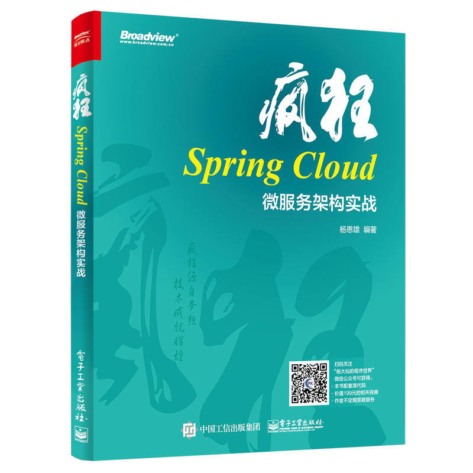

<!-- toc -->

# 第1章 Spring Cloud 概述

## 1.1 传统的应用

## 1.2 微服务与 Spring Cloud

## 1.3 学习方面的准备工作

# 第2章 搭建开发环境

## 2.1 安装和配置 Maven

## 2.2 安装 Eclipse

## 2.3 Spring Boot

## 2.4 Spring Boot 配置文件

## 2.5 Spring Cloud 版本

# 第3章 微服务发布与调用

## 3.1 Eureka 介绍

## 3.2 第一个 Eureka 服务

## 3.3 Eureka 集群搭建

## 3.4 服务实例的健康检查

## 3.5 Eureka 的常用配置

# 第4章 负载均衡

## 4.1 Ribbon 介绍

## 4.2 第一个 Ribbon 程序

## 4.3 Ribbon 的负载均衡机制

## 4.4 在 Spring Cloud 中使用 Ribbon

## 4.5 RestTemplate 负载均衡

# 第5章 REST 客户端 Feign

## 5.1 REST 客户端

## 5.2 使用 Feign

## 5.3 在 Spring Cloud 中使用 Feign

# 第6章 Spring Cloud 的保护机制

## 6.1 概述

## 6.2 第一个 Hystrix 程序

## 6.3 Hystrix 的使用

## 6.4 在 Spring Cloud 中使用 Hystrix

# 第7章 微服务集群网关

## 7.1 Zuul 框架介绍

## 7.2 在 Web 项目中使用 Zuul

## 7.3 在微服务集群中初试 Zuul

## 7.4 路由配置

## 7.5 Zuul 的其他配置

## 7.6 Zuul 功能进阶

# 第8章 微服务与消息驱动

## 8.1 Spring Cloud Stream 介绍

## 8.2 RabbitMQ 框架

## 8.3 Apache Kafka 框架

## 8.4 开发消息微服务

# 第9章 集群配置中心

## 9.1 概述

## 9.2 构建第一个例子

### 9.2.7 刷新 Bean

在 Spring 的容器中，有一个类型为 RefreshBean 的 Bean。当 /fresh 端点被访问时，负责处理刷新的 ContextRefresher 类会先去远程的配置服务器刷新配置，然后再调用 RefreshBean 的 refreshAll 方法来处理实例。容器中使用了 @RefreshBean 注解进行修饰的 Bean，都会在缓存中进行销毁，当这些 Bean 被再次引用时，就会创建新的实例，以此达到一个『刷新』的效果。

> *此处理解一下『惰性更新』的概念，说是更新，但实际只是销毁，需要用的时候再去获取新的值。*

## 9.3 配置的加密与解密

在实际应用中会涉及很多敏感的数据，这些数据会被加密保存到 SVN 仓库中，最常见的就是数据库密码。Spring Cloud Config 为这类敏感数据提供了加密和解密的功能，加密后的密文在传输给客户端前会进行解密。配置服务器支持对称加密和非对称加密，对称加密使用 AES 算法，非对称加密使用 RSA 算法。

### 9.3.4 非对称加密

对称加密算法在加密和解密时都使用同一个密钥，而非对称加密则使用一对密钥。使用公钥加密时，解密就需要使用私钥。Spring Cloud Config 同样支持非对称加密，使用 keytool 工具生成一对密钥用于加密和解密，在控制台输入以下命令：

```
keytool -genkeypair -alias "testKey" -keyalg "RSA" -keystore "D:\myTest.keystore"
```

## 9.4 其他配置

## 9.5 整合使用

# 第10章 微服务跟踪

## 10.1 概述

## 10.2 Sleuth 整合 Zipkin

## 10.3 Sleuth 整合 ELK

# 第11章 微服务数据库实战

## 11.1 概述

## 11.2 Spring Data 与 JPA

## 11.3 Spring Data 与 MongoDB

## 11.4 Spring Data 与 Redis

# 第12章 案例实战

## 12.1 概述

## 12.2 Spring Boot 与 JSP

## 12.3 模板引擎 Thymeleaf

## 12.4 图书管理案例


