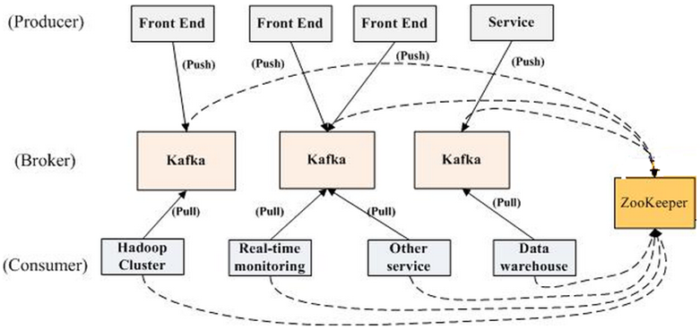

<!-- toc -->

## 第一章 大数据是什么

### 1.1 大数据导论

#### 1.1.1 大数据简史

这里特别要指出，Hadoop 并不等同于大数据，大数据也并不特指 Hadoop，大数据只是一门市场语言，代表的是一种概念，一种问题解决思路，一系列技术的集合，Hadoop 只是其中一种具体的处理数据的框架技术。

#### 1.1.2 大数据现状

#### 1.1.3 大数据与 BI

### 1.2 企业数据资产

### 1.3 大数据挑战

#### 1.3.1 成本挑战

#### 1.3.2 实时性挑战

#### 1.3.3 安全挑战

### 1.4 运营商大数据架构

#### 1.4.1 架构驱动的因素

#### 1.4.2 大数据平台架构

#### 1.4.3 平台发展趋势

### 1.5 运营商常见的大数据业务

#### 1.5.1 SQM (运维质量管理)

#### 1.5.2 CSE (客户体验提升)

#### 1.5.3 MSS (市场运维支撑)

#### 1.5.4 DMP (数据管理平台)

## 第二章 数据获取

### 2.1 数据分类

### 2.2 数据获取组件

### 2.3 探针

#### 2.3.1 探针原理

#### 2.3.2 探针的关键能力

##### 1. 大容量

##### 2. 协议智能识别

传统的协议识别方法采用 SPI (Shallow Packet Inspection) 检测技术。SPI 对 IP 包头中的 Five Tuples，即『五元组（源地址、目的地址、源端口、目的端口及协议类型）』信息进行分析，来确定当前流量的基本信息。

##### 3. 安全的影响

探针的核心能力就是获取通信的数据，但是随着越来越多的网站使用 HTTPS/QUIC 加密 L7 协议，传统的探针能力就会收到极大的限制，因为无法解析 L7 协议的内容。

##### 4. IB (InfiniBand) 技术

### 2.4 网页采集

#### 2.4.1 网络爬虫

##### 1. 基本原理

网络爬虫的基本工作流程如下：

1) 首先选取一部分种子 URL。
2) 将这些 URL 放入待抓取 URL 队列。
3) 从待抓取 URL 中去除待抓取的 URL，解析 DNS，得到主机的 IP，并将 URL 对应的网页下载下来，存储到已下载网页库中。此外，将这些 URL 放入已抓取 URL 队列中。
4) 分析已抓取到的网页内容中的其他 URL，并且将 URL 放入待抓取 URL 队列，从而进入下一个循环。

##### 2. 抓取策略

1) 深度优先遍历策略
2) 宽度优先遍历策略
3) 反向链接数策略：反向链接数是指一个网页被其他网页链接指向的数量。反向链接数表示的是一个网页的内容受到其他人推荐的程度。因此，很多时候搜索引擎的抓取系统会使用这个指标来评价网页的重要程度，从而决定不同网页的抓取顺序。在真实的网络环境中，由于广告链接、作弊链接的存在，反向链接数不可能完全等同于网页的重要程度。因此，搜索引擎往往考虑一些可靠的反向链接数。
4) PartialPageRank 策略
5) OPIC 策略
6) 大站优先策略

##### 3. 更新策略

1) 历史参考策略：顾名思义，历史参考策略是指根据页面以往的历史更新数据，预测该页面未来何时会发生变化。一般来说，是通过泊松过程进行建模来预测的。
2) 用户体验策略
3) 聚类抽样策略

##### 4. 系统架构

#### 2.4.2 简单爬虫 Python 代码示例

### 2.5 日志收集

Flume 是 Cloudera 公司的一款高性能、高可用的分布式日志收集系统，现在已经是 Apache 的顶级项目。同 Flume 相似的日志手机系统还有 Facebook Scribe、Apache Chuwka。

### 2.6 数据分发中间件

#### 2.6.1 数据分发中间件的作用

#### 2.6.2 Kafka 架构和原理

##### 1. Kafka 产生背景

Kafka 是 LinkedIn 于 2010 年 12 月开源的消息系统，主要用于处理活跃的流式数据。

##### 2. Kafka 架构

整个架构中包括三个角色。

- 生产者 (Producer)：消息和数据产生者。
- 代理 (Broker)：缓存代理，Kafka 的核心功能。
- 消费者 (Consumer)：消息和数据消费者。

整体架构很简单，Kafka 给 Producer 和 Consumer 提供注册的接口，数据从 Producer 发送到 Broker，Broker 承担一个中间缓存和分发的作用，负责分发注册到系统中的 Consumer。

##### 3. 设计要点

Kafka 非常高效，下面介绍一下 Kafka 高效的原因，对理解 Kafka 非常有帮助。

- 直接使用 Linux 文件系统的 Cache 来高效缓存数据。
- 采用 Linux Zero-Copy 提高发送性能。传统的数据发送需要发送 4 次上下文切换，采用 Sendfile 系统调用之后，数据直接在内核态交换，系统上下文切换减少为 2 次。根据测试结果，可以提高 60% 的数据发送性能。数据在磁盘上的存取代价为 O(1)。

##### 4. Kafka 的消息存储方式

##### 5. 如何通过 offset 查找 Message

Segment Index File 采取稀疏索引存储方式，可以减少索引文件大小，通过 Linux mmap 接口可以直接进行内存操作。稀疏索引为数据文件的每个对应 Message 设置一个元数据指针，它比稠密索引节省了更多的存储空间，但查找起来需要消耗更多的时间。

##### 6. 主要代码解读

##### 7. 生态系统

从 Kafka 官方网站可以看到它的生态范围非常广，覆盖从发行版、流处理对接、Hadoop 集成、搜索集成到周边组件，如管理、日志、发布、打包、AWS 集成等。

##### 8. Kafka 应用案例

##### 9. Kafka 性能

##### 10. 代码样例

## 第三章 流处理

我们将大数据处理按处理时间的跨度要求分为以下几类，从短到长分别是：

- 基于实时数据流的数据处理 (Streaming Data Processing)，通常的时间跨度在数百毫秒到数秒之间。
- 基于历史数据的交互式查询 (Interactive Query)，通常的时间跨度在数十秒到数分钟之间。
- 复杂的批量数据处理 (Batch Data Processing)，通常的时间跨度在几分钟到数小时之间。

### 3.1 算子

常见的算子有 Group、Sort、Orderby、Window 等，在后面的章节里我们会不停地看到算子这个概念。

### 3.2 流的概念

### 3.3 流的应用场景

#### 3.3.1 金融领域

流应用历史最悠久且最广泛的应该是金融领域，可以通过 K 线图实时分析股票价格来判断股票是否可以买入。

#### 3.3.2 电信领域

电信领域一个常见的样例是质差补偿。客户在通话过程中发生断线、掉话，需要识别出来，并通过发送道歉短信、返还话费等补偿措施来提升用户满意度，提升运营商品牌。

### 3.4 业界两种典型的流引擎

#### 3.4.1 Storm

##### 1. Storm 的基本概念

##### 2. Storm 记录级容错的基本原理

##### 3. Storm 的事务拓扑

#### 3.4.2 Spark Streaming

BDAS 是伯克利大数据处理协议栈，是以 Spark 为基础的一套软件栈。它利用基于内存的通用计算模型，同时支持 Batch、Interactive、Streaming 的处理，且兼容支持 HDFS 和 S3 等分布式文件系统，可以部署在 YARN 和 Mesos 等流行的集群资源管理上。

其中，Spark 可以替代 MapReduce 进行批处理，利用其基于内存的特点，特别擅长迭代式和交互式数据处理；Spark 可以处理大规模数据的 SQL 查询，兼容 Hive 的 HQL。同时利用 Spark 在内存中的处理速度，以 Mini-Batch 的形式模拟 Streaming 的处理，应对对实时性要求并不是特别高的一般型应用。

##### 1. Spark Streaming 架构

##### 2. Spark Streaming 编程举例

##### 3. Spark Streaming 深入

#### 3.4.3 融合框架

##### 1. Flink

##### 2. Google Cloud Dataflow

### 3.5 CEP

#### 3.5.1 CEP 是什么

#### 3.5.2 CEP 的架构

#### 3.5.3 Esper

### 3.6 实时结合机器学习

#### 3.6.1 Eagle 的特点

#### 3.6.3 Eagle 概览

## 第四章 交互式分析

### 4.1 交互式分析的概念

### 4.2 MPP DB 技术

#### 4.2.1 MPP 的概念

#### 4.2.2 典型的 MPP 数据库

#### 4.2.3 MPP DB 调优实战

#### 4.2.4 MPP DB 适用场景

### 4.3 SQL on Hadoop

#### 4.3.1 Hive

#### 4.3.2 Phoenix

#### 4.3.3 Impala

### 4.4 大数据仓库

#### 4.4.1 数据仓库的概念

#### 4.4.2 OLTP/OLAP 对比

#### 4.4.3 大数据场景下的同与不同

#### 4.4.4 查询引擎

#### 4.4.5 存储引擎

## 第五章 批处理技术

### 5.1 批处理技术的概念

### 5.2 MPP DB 技术

### 5.3 MapReduce 编程框架

#### 5.3.1 MapReduce 起源

#### 5.3.2 MapReduce 原理

#### 5.3.3 Shuffle

#### 5.3.4 性能差的主要原因

### 5.4 Spark 架构和原理

#### 5.4.1 Spark 的起源和特点

#### 5.4.2 Spark 的核心概念

### 5.5 BSP 框架

#### 5.5.1 什么是 BSP 模型

#### 5.5.2 并行模型介绍

#### 5.5.3 BSP 模型基本原理

#### 5.5.4 BSP 模型的特点

#### 5.5.5 BSP 模型的评价

#### 5.5.6 BSP 与 MapReduce 对比

#### 5.5.7 BSP 模型的实现

#### 5.5.8 Apache Hama 简介

### 5.6 批处理关键技术

#### 5.6.1 CodeGen

#### 5.6.2 CPU 亲和技术

## 第六章 机器学习与数据挖掘

## 第七章 资源管理

## 第八章 存储是基础

## 第九章 大数据云化

## 第十章 大数据技术开发文档