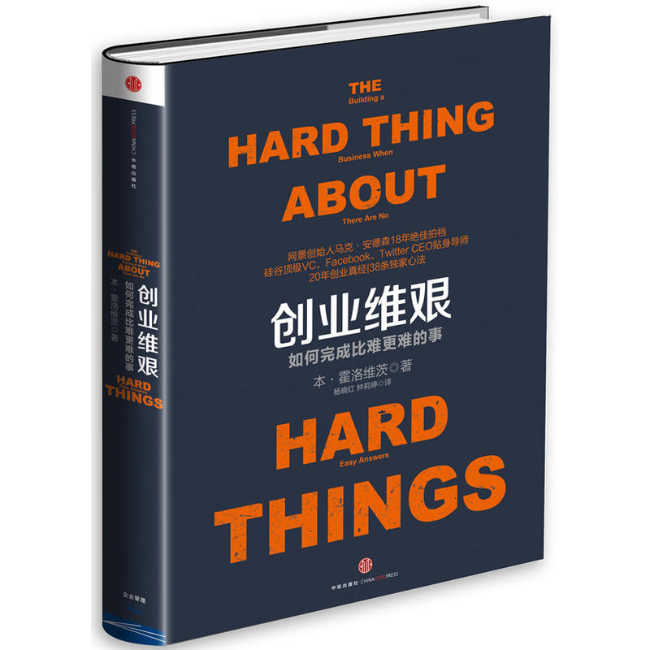

<!-- toc -->

## 第一章 从革命者到风险投资家

**这里有我的一切，老婆，孩子，我的生活。漆黑长夜，我曾属于这里，我的起起伏伏，我的失足堕落，我的痛苦磨难，我的热情，我的勇气。**

**- 美国说唱歌手 DMX《我们是谁》**

大学期间的一个夏天，我得到了一份工作，在一家名叫硅谷图形 (SGI) 的计算机公司当工程师。这段经历令我兴奋不已。这家公司发明了现代计算机图形并为一套全新的应用程序提供驱动，例如，电影《终结者2》中令人惊叹的飞行模拟器。公司里的每个人都才华横溢，极具创造性。那时我想，我一辈子都要在硅谷图形公司工作。

> CC：与优秀的人一起工作才能使自己变得更优秀，同时也会节约时间，心情愉悦。

有一天，天气非常炎热，父亲过来看我们。我们用不起空调，在40多摄氏度的高温中，我和父亲坐在那里汗流浃背，三个孩子在哇哇大哭。
父亲转向我，说：『儿子，你知道什么东西便宜吗？』
我根本不清楚父亲在说什么，于是回答说：『不知道，是什么呢？』
『鲜花。那你知道什么东西最贵吗？』他问。
我仍然回答：『不知道，是什么呢？』
他说：『离婚。』
这番玩笑话（其实并非真的玩笑话）令我意识到我已经白白消耗了太多时间。直到那一刻之前，我从未真正做出过任何重大选择。我觉得我精力无限，生活中，我可以同时做很多事情，但父亲的这番话却突然令我明白，如果沿着现在的轨道继续前进，我也许会失去自己的家庭。所有事情一起抓，就会在最重要的事情上遭遇失败。我第一次迫使自己不要只按轻重缓急的标准来看世界。过去的我一直以为，自己既能干好事业，又能兼顾所有的兴趣爱好，同时还能维护好家庭。而且，我总把自己摆在首位。当你成为某个家庭或某个团体的一分子时，这种思维方式会令你陷入麻烦。在我心里，我坚信自己是个好人，毫不自私，但我的所作所为却暴露出我并非这样的好人。我绝不能像这样继续幼稚下去，我必须分清主次轻重，成熟起来。我必须先考虑自己最关心的人，然后再考虑自己。

> CC：20岁的时候用心恋爱，30岁的时候用心工作，也许是我做过的最正确的事情。

## 第二章 Loudcloud 沉浮录：我会活下去

**你以为我会崩溃吗？你以为我会坐以待毙吗？噢，不，我不会。我会活下去。**

**- 美国黑人女歌星格洛丽亚盖纳《我会活下去》**

当时，比尔已经60多岁了，头发灰白，声音粗钝，却仍像20岁的小伙子一样精力充沛。最初，他是一名大学足球教练，40岁才进入商界。尽管入行较晚，但最终却登上了财捷集团 (Intuit) CEO 的宝座。此后，他成为高科技领域的一个传奇，为多位大名鼎鼎的 CEO 提供过指导，例如苹果公司的史蒂夫乔布斯、亚马逊公司的杰夫贝佐斯，以及谷歌公司的埃里克施密特。

> CC：无论年龄多大，心要保持年轻。

然而，此次的侥幸成功却表明，我们的整体运营方式太过脆弱。9月26日，当我们最大的竞争对手 Exodus 公司申请破产时，我们都颇为震惊，因为就在一年多前，该公司的市值还高达500亿美元。而且就在9个月前，该公司凭借一个全资助方案刚刚筹得8亿美元的资金。Exodus 公司的一位高管事后开玩笑似的对我说：我们开车冲下悬崖时，没有留下任何刹车的痕迹。我想，既然 Exodus 公司都能以如此之快的速度失去其500亿美元的市值和8亿美元的资金，那我必须未雨绸缪，制订一个后备计划。

> CC：跟股市一样，涨得慢跌得急。

当时，情况十分复杂，我们有450名员工，其中440名都在从事云计算服务，我们所有的收益都是他们辛勤工作的成果。我无法告诉这些员工以及我的管理团队，我正在考虑放弃云计算服务，因为我们的股价有可能会暴跌至一文不值，最终令我们转让公司、避免破产的所有希望都化为泡影。

此时，我信任的只有一个人，他就是约翰奥法雷尔。约翰主要负责公司的业务发展事宜，此外，他还是我所认识的最了不起的大人物。为了说明这一点，我这样打个比方，假如你已经走到了生命的尽头，正面临着上帝对你做最后的判决，由于事关你能否得到永生，因此你可以选一个人代表你去和上帝进行交涉。此时，你会选谁呢？如果是我，我一定会选我那位来自爱尔兰的好兄弟约翰奥法雷尔。

> CC：哈哈哈，感觉这个角色也特别适合我。

7周之后，我们和 EDS 公司达成了协议，他们用6350万美元现金买下 Loudcloud 公司，并承担 Loudcloud 公司的相关债务和现金消耗，而我们将保留知识产权和 Opsware，摇身一变成为一家软件公司。接下来，EDS 公司还以每年2000万美元的价格用我们的软件运行 Loudcloud 公司和 EDS 公司。我认为，这次交易无论对 EDS 公司还是我们自己来说，都非常划算，这肯定比破产好得多。18个月来，我第一次可以大大地松一口气了。可是，事情并不是表面上这么简单。出售 Loudcloud 公司还意味着要将大约150名员工一起转给 EDS 公司，同时还要辞掉其他140名员工。

我打电话给比尔坎贝尔，告诉他交易已经达成，我们将于周一在纽约宣布这一消息。比尔说：你不能去纽约参加发布会真是太遗憾了，不过你必须派马克去。我问：为什么？他说：你必须守着公司，确保所有人都知道自己的处境。你一分钟都不能拖，大家有权知道自己现在是继续跟着你在 EDS 公司干，还是要另谋出路。噢，真该死！比尔说得对。我派马克去了纽约，然后准备告诉大家他们现在的处境。事实证明，比尔的那条小小的建议为我们日后重建公司打下了必要的基础。如果我们不能公平、公正地对待那些即将离开公司的人，那些留下的人就永远不会再信任我了。只有亲身经历过极其可怕并极具毁灭性的大风大浪的 CEO 才会在那样一个时刻提出这样的建议。

> CC：谨记！

## 第三章 转型 Opsware：这一次，跟着感觉走

**我继续前进，追求唯一的完美方向，不能因为恐惧而迷失方向。**

**- 美国歌手 Jay.Z《下一步》**

克兰尼组建了一支高端销售队伍后，彻底更改了销售程序，并为所有销售人员制订了一项极其严格的培训计划。他要求大家必须完全精通销售策略。任何闪失，无论是技术上的、技能上的或知识上的，克兰尼都绝不容忍。

> CC：生死存亡之际，我们甚至需要摒弃舒适时期的优良品德，一切都只是为了达到最终的目的，对于领导者来说更是如此，对别人的宽容就是对自己的残忍。

## 第四章 陷入绝境

对于公司创建者或 CEO 而言，最重要的一条管理经验就是要绝对保持理性。作为 CEO，我个人最大的一项进步就是我停止使用过于积极正面的管理方式。

健康的企业文化会鼓励员工公开坏消息。只有允许自由并公开讨论问题，公司才能迅速解决问题。企图掩盖问题只会令所有员工感到灰心。因此，CEO 应该采取的做法是：建立一种奖励文化，而不是惩罚文化，对那些公开提出问题并为其找到解决方法的人予以奖励。

> CC：奖励而不是惩罚。

在执行裁员决定之前，CEO 必须向公司全体人员发表讲话。在向大家通报总体情况的过程中，CEO 必须为管理者们解释裁员的合理性。如果这一点做得好，管理人员在裁员时就会更加容易。务必牢记财捷集团前 CEO 比尔坎贝尔告诉我的一句话：话是说给那些留下来的人听的。这些人会非常关心你对待他们同事的方式。你裁掉的员工之中，有很多人都和留下来的人关系密切，因此，你一定要给予他们足够的尊重。毕竟，公司还要向前发展，因此你必须把握尺度，不要过度表达歉意。

## 第五章 依次管理好人、产品和利润

好的产品经理会制作附加材料、常见问题解答、业务简报以及白皮书，供销售人员、营销人员和主管参考或使用。差的产品经理会抱怨自己整天都在为销售人员解答问题，忙得不可开交。好的产品经理会预测出产品的严重缺陷，提出真正的解决方案，而差的产品经理整天都在解决问题。

好的产品经理会将一些重要问题以书面形式记录下来（竞争中的良策、艰难的框架选择、艰难的产品决策、攻占或放弃市场）。差的产品经理只会口头形式表达自己的意见，抱怨『当权者』不允许他这样做。一旦失败，他们往往会说自己早就料到会失败。

> CC：行动大于言语，不仅仅是针对产品经理，对于我们这些研发人员也是如此，看到哪里有问题就想办法去改进并付诸行动，而不是仅仅停留在嘴边的评论，等出了问题再把锅甩给前人。

在『孙子兵法』中，孙子警告说，给团队下达一个不可能完成的任务会削弱其实力。我并没有削弱团队的实力，却打乱了团队的工作顺序。正确的做法应该是，预先确认哪些事项更重要，然后实现每一季度销售额最大化或提高预测能力。只有给出第二种回答时，这个指导才有意义。

## 第六章 关注眼前的麻烦

多年的管理经验告诉我，主管可以通过努力提高他的业务能力和工作表现，可一旦失去人心，那就回天乏力了。

> CC：人心永远是最重要的。

## 第七章 前途未卜时怎么办

**这是为贫民窟的人而歌，只有他们懂得其中真意。**

**- 美国说唱歌手纳斯《唐》**

大多数人对『领导才能』的定义都类似于高等法院的法官伯特斯图尔特对『色情文学』的那个著名定义：见到它，我就认得出它。在此，我认为领导才能是那些可以衡量一个领导者基本素质的因素：有多少人愿意追随他，有哪些人愿意追随他，追随他的人都属于什么层次。

作为 CEO，你不可能有充足的时间搜集所有的信息，然后再做决定。每一个寻常的日子里，你都得做出大大小小上百个决定，不可能为了对某一个决定进行最全面的材料搜集和最详尽的分析，你就停下所有的工作。明确了这一点，你就应该用心在日常生活中持续且系统的搜集信息，以便在决策时刻来临时有备而战。

> CC：持续学习！

## 第八章 创业头条法则：没有法则

**这些事都打不到我，只会让我更坚强。我想让你快些来，因为我不能再等待。我知道我现在要做出正确选择，因为我不能再错下去。我已等待一整夜，为你等待一整夜。**

**- 美国饶舌歌手、唱片制作人坎耶维斯特《更强大》**

讲述这段经历是想提醒大家，当你以为在生意场上可以信赖别人时，结局往往令你大失所望。出现这种情况时，一味地计较谁是谁非毫无意义。你需要做的，就是打起精神去应对那些危机。

> CC：其他很多情况也是如此，相比于追究责任，更重要的是解决问题。

## 第九章 是结束，也是开始

**我们走在同一条路上，穿的却是各自的鞋。我们住在同一栋楼里，看到的却是不同的风景。**

**- 德里克《云端之上》：**

在与企业家们合作的今天，我总是着力宣传这个理念。接纳你的不同，接纳你的背景，接纳你的直觉。如果奥妙不在其中，那就说明没有奥妙。我能够见证他们所经历的艰难，却无法提供具体的对策。我能做的，就是帮助他们从自己心中、从自己身上寻找答案。有些时候，他们比我更能从纷乱中找到宁静。

> CC：别人只能给予建议，决定终需自己来做。
